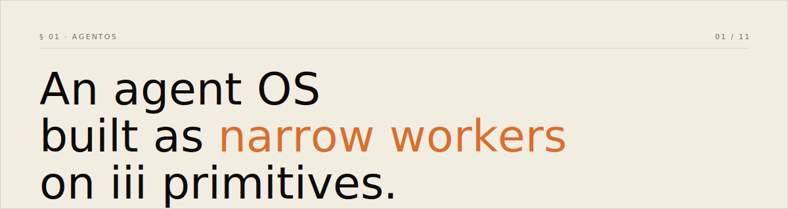

<p align="center">
  <picture>
    <source media="(prefers-color-scheme: dark)" srcset="assets/banner-dark.svg">
    <source media="(prefers-color-scheme: light)" srcset="assets/banner-light.svg">
    
  </picture>
</p>

<p align="center">
  <a href="LICENSE"></a>
  
  
  
  
</p>

<p align="center">
  <a href="https://www.agentsos.sh">website</a> ·
  <a href="ARCHITECTURE.md">architecture</a> ·
  <a href="#-03--quickstart">quickstart</a> ·
  <a href="#-06--workers">workers</a>
</p>

---

## § 01 · Thesis

AgentOS isn't another agent framework. It's *what's left* when the runtime becomes someone else's problem.

65 narrow workers — one Rust binary per domain — register Functions and Triggers on the [iii engine](https://github.com/iii-hq/iii). Every capability is one shape: `register_function(...)`. The engine carries routing, retries, state, and traces.

| ~~not~~ | yes |
|---|---|
| ~~assemble a runtime from category-shaped pieces~~ | collapse the categories onto one bus |
| ~~teach the model your DSL~~ | teach it three nouns |
| ~~bespoke agent runtime~~ | narrow workers on iii |

## § 02 · Three primitives

| Primitive | What it does | Examples |
|---|---|---|
| **Worker** | One Rust binary per domain. Connects to the engine over WebSocket. | `agent-core`, `llm-router`, `realm` |
| **Function** | A named handler registered by a Worker. | `agent::chat`, `llm::route`, `memory::search` |
| **Trigger** | Binds a Function to HTTP, cron, or pub/sub. | `POST /v1/chat → agent::chat` |

That's the whole protocol. Workers stay narrow; everything else lives in the engine.

## § 03 · Quickstart

```bash
curl -fsSL https://install.iii.dev/iii/main/install.sh | sh
git clone https://github.com/iii-experimental/agentos && cd agentos
cargo build --workspace --release
iii --config config.yaml &
for w in target/release/agentos-*; do "./$w" & done
```

Engine boots on port 49134. 64 Rust workers connect. 257 functions register. Then:

```bash
curl -X POST http://127.0.0.1:3111/v1/realms \
  -H 'Content-Type: application/json' \
  -d '{"name":"prod","description":"production"}'
```

## § 04 · Calling a function

```rust
use iii_sdk::{register_worker, InitOptions, TriggerRequest};
use serde_json::json;

let iii = register_worker("ws://localhost:49134", InitOptions::default());

let result = iii.trigger(TriggerRequest {
    function_id: "memory::recall".to_string(),
    payload: json!({"agentId": "alice", "query": "..."}),
    action: None,
    timeout_ms: None,
}).await?;
```

This is the only inter-worker contract. There is no shared in-process state.

## § 05 · Registering one

```rust
use iii_sdk::{register_worker, InitOptions, RegisterFunction};
use iii_sdk::error::IIIError;
use serde_json::{json, Value};

#[tokio::main]
async fn main() -> Result<(), Box<dyn std::error::Error>> {
    let iii = register_worker("ws://localhost:49134", InitOptions::default());

    iii.register_function(
        RegisterFunction::new_async("analyst::summarize", |input: Value| async move {
            let topic = input["topic"].as_str().unwrap_or("");
            Ok::<Value, IIIError>(json!({ "summary": format!("on {}", topic) }))
        })
        .description("Summarize a topic"),
    );

    tokio::signal::ctrl_c().await?;
    iii.shutdown_async().await;
    Ok(())
}
```

## § 06 · Workers

64 Rust + 1 Python, grouped by responsibility.

| Group | Workers |
|---|---|
| Reasoning | `agent-core` `llm-router` `council` `swarm` `directive` `mission` |
| State | `realm` `memory` `ledger` `vault` `context-manager` `context-cache` |
| Coordination | `orchestrator` `workflow` `hierarchy` `coordination` `task-decomposer` |
| Execution | `wasm-sandbox` `browser` `code-agent` `hand-runner` `lsp-tools` |
| Safety | `security` `security-headers` `security-map` `security-zeroize` `skill-security` `approval` `approval-tiers` `rate-limiter` `loop-guard` |
| Surfaces | `a2a` `a2a-cards` `mcp-client` `skillkit-bridge` `bridge` `streaming` |
| Channels | `channel-{bluesky,discord,email,linkedin,mastodon,matrix,reddit,signal,slack,teams,telegram,twitch,webex,whatsapp}` |
| Telemetry | `telemetry` `pulse` `session-lifecycle` `session-replay` `feedback` `eval` `evolve` `hashline` `hooks` `cron` |
| Embeddings | `embedding` (Python) |

Each worker ships `iii.worker.yaml` declaring its registry shape. CI validates conformance on every PR.

## § 07 · Sandbox surfaces

Two distinct namespaces, never overlap:

| Namespace | Worker | Semantics |
|---|---|---|
| `sandbox::*` | builtin iii-sandbox (engine) | Ephemeral microVMs from OCI rootfs |
| `wasm::*` | agentos `wasm-sandbox` | wasmtime, fuel-metered, sub-millisecond cold start |

CI's `no sandbox::* clash with builtin` job greps the workspace to enforce the boundary.

## § 08 · Layout

```
workers/         64 Rust + 1 Python (embedding)
crates/          cli, tui — surfaces (HTTP clients, not workers)
e2e/             vitest end-to-end suite (live engine + workers)
tests/           Rust integration tests
hands/           agent personas (TOML, consumed by hand-runner)
integrations/    MCP server configs (TOML, consumed by mcp-client)
agents/          agent templates
workflows/       workflow definitions (YAML)
plugin/          reusable agent/command/skill/hook bundles
config.yaml      iii engine boot config
website/         agentsos.sh — design.md aesthetic, three themes
```

See [ARCHITECTURE.md](ARCHITECTURE.md) for the full primitive flow and worker manifest spec.

## § 09 · TUI

Chat-first terminal UI lives in `crates/tui`:

```bash
cargo run --release -p agentos-tui
```

| Key | Action |
|---|---|
| `/` | Slash command (`/agent`, `/memory`, `/worker`, `/realm`, `/skill`, `/hand`, `/help`, `/quit`) |
| `Tab` | Autocomplete current slash command against the live function registry |
| `?` | Toggle keymap overlay |
| `Ctrl+P` | Command palette (fuzzy-jump to any pane) |
| `Ctrl+W` | Worker picker — browse + install workers without leaving the TUI |
| `Esc` | Close overlay or clear input |
| `1-9 0` | Direct pane switch (Dashboard / Agents / Chat / Channels / …) |

If the engine is offline or no workers are connected, the TUI shows a first-run overlay with copy-paste commands instead of an empty list. Slash completions pull from `GET /iii/functions` so anything a worker registers is immediately discoverable.

## § 10 · Build and test

```bash
cargo build --workspace --release   # all 64 Rust workers
cargo test --workspace --release    # 1,316 tests
npm install && npm run test:e2e     # live engine + workers (requires AGENTOS_API_KEY)
```

## § 11 · Versioning

| | version |
|---|---|
| iii engine | `v0.11.6` |
| iii-sdk (Rust) | pinned at `=0.11.6` in workspace |
| iii-sdk (Node) | `0.11.6` for the e2e harness |
| iii-sdk (Python) | `>=0.11.6` for the embedding worker |
| agentos | `0.0.1` — pre-1.0; reserved for behavioral proof against live infra, not feature completeness |

## § 12 · License

Apache-2.0. Same family as `iii-sdk` and the rest of the iii ecosystem.
